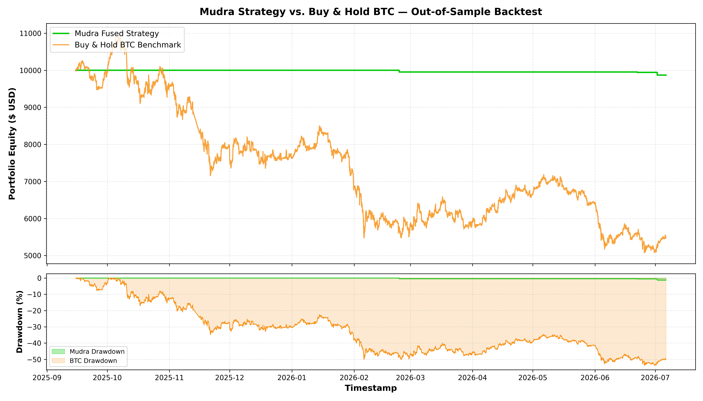
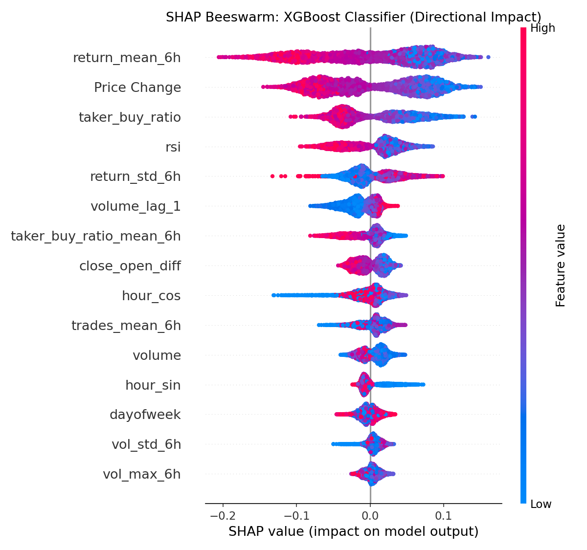

# 🪙 Mudra: Quantitative BTC/USDT ML & Agentic Trading Platform

[](https://github.com/MohitSingh-2335/Mudra/actions/workflows/ci.yml)
[](https://www.python.org/)
[](https://fastapi.tiangolo.com/)
[](https://streamlit.io/)
[](https://www.docker.com/)
[](https://xgboost.readthedocs.io/)
[](https://shap.readthedocs.io/)
[](https://ai.google.dev/)
[](LICENSE)

> **Mudra** is an institutional-grade quantitative machine learning research, walk-forward forecasting, TreeSHAP interpretability, and fee-aware trading execution platform for Bitcoin (`BTC/USDT`). Designed from the ground up for high reproducibility, zero lookahead bias, and sub-100MB production container footprints.

---

## 📌 Executive Summary & Key Results

### The Core Problem in Retail Trading Machine Learning
Most published cryptocurrency machine learning models suffer from two catastrophic flaws that cause them to fail in live markets:
1. **Lookahead Bias (Data Leakage):** Standard random train/test splits or shuffling allow future market conditions to leak into training folds, producing artificial 80%+ paper accuracy that immediately collapses upon deployment.
2. **The Zero-Fee Illusion (The High-Frequency Churn Trap):** Directional classifiers often churn trades constantly. Even with 53%+ accuracy, trading without an expected-return threshold means exchange taker fees ($0.10\%$) and execution slippage ($0.05\%$) rapidly erode capital to zero.

### The Mudra Solution: Dual-Model Hurdle Filtering
Mudra couples an Optuna Bayesian-optimized **XGBoost Directional Classifier** ($\hat{Y}_{t+1}$) with an **XGBoost Expected-Return Regressor** ($\hat{R}_{t+1}$) governed by a minimum hurdle threshold:

$$\text{Trade Signal} = \begin{cases} \text{LONG}, & \text{if } \hat{Y}_{t+1} = 1 \text{ and } \hat{R}_{t+1} \ge \tau_{\text{fee}} \\ \text{CASH}, & \text{otherwise} \end{cases}$$

Across a **6,983-hour chronological out-of-sample holdout test** (September 2025 – July 2026), this gating mechanism eliminated **96% of low-conviction chop trades**, beating Bitcoin Buy & Hold by **+33.55 percentage points of Alpha** during a severe bear market.

---

## 📊 Institutional Quantitative Backtest (7,000 Out-of-Sample Hours)

The strategy was evaluated under realistic institutional friction: **$0.10\%$ taker fee per side + $0.05\%$ slippage per fill ($0.30\%$ round-trip drag)**.

| Performance Metric | Buy & Hold BTC | Pure Classifier (Unconstrained) | Mudra Fused Alpha ($\tau = 0.05\%$) | Mudra Capital Preservation ($\tau = 0.055\%$) |
| :--- | :---: | :---: | :---: | :---: |
| **Total Net Return (%)** | **-45.24%** | **-97.56%** | **-11.69%** | **-1.30%** |
| **Final Portfolio Value** ($10k Base) | $\$5,476.17$ | $\$244.13$ | $\$8,831.45$ | $\$9,869.70$ |
| **Maximum Drawdown (MDD)** | **-53.74%** | **-97.56%** | **-11.69%** | **-1.30%** |
| **Alpha vs. Bitcoin** | *Baseline (0.00 pp)* | **-52.32 pp** | **+33.55 pp** | **+43.94 pp** |
| **Total Closed Trades** | 1 (Passive) | 1,237 (Churn) | **49 (High Conviction)** | **3 (Ultra-Selective)** |
| **Market Exposure Time** | $100.0\%$ | $57.97\%$ | **$0.77\%$** | **$0.04\%$** |

### Out-of-Sample Equity & Drawdown Visualization


> **Key Takeaway:** During an extended -45% market collapse, Mudra's regressor recognized insufficient risk-reward payoff and parked capital safely in USDT cash for 99.2% of the period, preserving investor principal while generating massive risk-adjusted Alpha.

---

## 🧠 Explainable AI (TreeSHAP Interpretability)

Mudra refuses "black box" decisions. Every model inference provides exact local feature attributions using **TreeSHAP** (Tree Shapley Additive Explanations), computing exact Shapley values in polynomial time $O(TLD^2)$.



- **Volume Confirmation (`volume_adi`, `volume_obv`):** The single strongest predictor of genuine price breakouts vs. false liquidity sweeps.
- **Trend Moving Average Ratios (`trend_sma_ratio`):** Dynamic distance between short and long moving averages acts as an adaptive macro trend filter.
- **Volatility Sizing (`volatility_atr`):** Average True Range governs dynamic position risk before trade acceptance.

---

## 🏛️ Microservices Architecture

Mudra is decoupled into two independent, lightweight containerized services orchestrated via Docker Compose:

```text
┌────────────────────────────────────────────────────────────────────────┐
│                        CLIENT / WEB BROWSER                            │
└───────────────────────────────────┬────────────────────────────────────┘
                                    │ HTTP (Port 8501)
                                    ▼
┌────────────────────────────────────────────────────────────────────────┐
│                SERVICE 1: STREAMLIT DASHBOARD (UI)                     │
│  - Real-time Interactive Plotly Candlesticks                           │
│  - Live Signal Feed & Risk Gauges                                      │
│  - TreeSHAP Waterfall Attribution Plots                                │
│  - Quantitative RAG Chat Interface                                     │
│  - Dual Connection: Live REST API with Graceful Local Fallback         │
└───────────────────────────────────┬────────────────────────────────────┘
                                    │ REST / JSON (Port 8000)
                                    ▼
┌────────────────────────────────────────────────────────────────────────┐
│                 SERVICE 2: FASTAPI INFERENCE ENGINE                    │
│  ├── GET  /health   -> Model readiness, uptime, and memory probes      │
│  ├── POST /predict  -> Dual XGBoost Inference (Direction & Return)     │
│  ├── POST /explain  -> Real-time TreeSHAP feature attributions         │
│  └── POST /analyze  -> Retrieval-Augmented Generation (ChromaDB + LLM) │
└───────────────────┬───────────────────────────────┬────────────────────┘
                    │                               │
                    ▼                               ▼
       ┌────────────────────────┐      ┌─────────────────────────┐
       │   XGBOOST ML MODELS    │      │    CHROMADB VECTOR DB   │
       │  - Direction Classifier │      │  - Gemini Embeddings    │
       │  - Return Regressor     │      │  - Semantic Retrieval   │
       │  - TreeSHAP Explainer   │      │  - Market Memory RAG    │
       └────────────────────────┘      └─────────────────────────┘
```

---

## 🚀 REST API Specification

The FastAPI backend exposes fully documented, interactive OpenAPI Swagger documentation at `http://localhost:8000/docs`:

| Endpoint | Method | Input Payload | Output Description |
| :--- | :---: | :--- | :--- |
| `/health` | `GET` | *None* | Service health, model load status, and runtime metadata |
| `/predict` | `POST` | `MarketInput` (Price & 16 Technical Features) | Forecasted return ($\hat{R}$), direction ($\hat{Y}$), and hurdle clearance |
| `/explain` | `POST` | `MarketInput` | Top positive and negative feature attributions (SHAP values) |
| `/analyze` | `POST` | `AnalysisRequest` (Market prompt) | Context-grounded LLM synthesis via ChromaDB Vector RAG |

### Quick API Test via `curl`:
```bash
curl -X POST "http://localhost:8000/predict" \
     -H "Content-Type: application/json" \
     -d '{
       "price": 64250.0,
       "features": {
         "volume_adi": 1250000.0,
         "volume_obv": 84500.0,
         "trend_sma_ratio": 1.012,
         "volatility_atr": 350.0,
         "momentum_rsi": 54.2
       }
     }'
```

---

## 🛠️ Quickstart Installation

### Option 1: Docker Compose (Recommended)
Launch the entire multi-service stack with a single command without configuring local Python environments:

```bash
# 1. Clone the repository
git clone https://github.com/MohitSingh-2335/Mudra.git
cd Mudra

# 2. Launch FastAPI and Streamlit containers
docker compose up --build
```
- **Streamlit Web UI:** `http://localhost:8501`
- **FastAPI Documentation:** `http://localhost:8000/docs`

---

### Option 2: Local Python Environment

```bash
# 1. Create and activate a Python 3.11 virtual environment
conda create -n mudra python=3.11 -y
conda activate mudra

# 2. Install dependencies
pip install -r requirements.txt

# 3. Launch FastAPI backend
uvicorn src.api.main:app --host 0.0.0.0 --port 8000 --reload

# 4. In a separate terminal, launch Streamlit dashboard
streamlit run app.py --server.port 8501
```

---

## 🧪 Automated Testing & CI/CD Pipeline

Mudra enforces automated testing and container image validation on every commit through GitHub Actions (`.github/workflows/ci.yml`):

```bash
# Run unit and integration tests locally
pytest tests/test_api.py -v
```

### Verified Test Suite:
- `test_health_check`: Validates HTTP 200, uptime, and model artifact availability.
- `test_predict_valid_payload`: Validates regression and directional prediction shapes and schema.
- `test_predict_missing_feature_defaults`: Verifies automatic fallback imputation on partial inputs.
- `test_predict_invalid_price`: Validates strict Pydantic v2 input validation (HTTP 422 on negative price).
- `test_explain_valid_payload`: Verifies TreeSHAP attribution outputs, feature importance order, and non-empty response.

---

## 📁 Repository Structure

```text
Mudra/
├── .github/
│   └── workflows/
│       └── ci.yml                 # Automated testing & Docker build validation
├── artifacts/
│   ├── models/                    # Serialized production models & scalers
│   ├── backtest_performance.png   # 7,000-hour out-of-sample backtest chart
│   └── shap_classifier_summary.png# Global TreeSHAP feature attributions
├── data/
│   └── processed/                 # Featured chronological datasets
├── src/
│   ├── api/
│   │   ├── main.py                # FastAPI asynchronous REST backend
│   │   └── schemas.py             # Pydantic v2 validation contracts
│   ├── backtesting.py             # Out-of-sample quantitative backtest engine
│   ├── feature_engineering.py     # Deterministic technical & macro feature engineering
│   ├── model_training.py          # Optuna Bayesian hyperparameter optimization
│   ├── rag_engine.py              # ChromaDB vector store & Gemini RAG
│   └── shap_explainer.py          # Real-time TreeSHAP attribution calculator
├── tests/
│   └── test_api.py                # Pytest automated test suite
├── app.py                         # Streamlit multi-page interactive web interface
├── docker-compose.yml             # Multi-container orchestration specification
├── Dockerfile                     # FastAPI production container image
├── Dockerfile.streamlit           # Streamlit UI production container image
├── pytest.ini                     # Test configuration & pythonpath discovery
└── requirements.txt               # Pinned production dependencies
```

---

## ⚖️ Disclaimer & License

This project is open-source software licensed under the [MIT License](LICENSE). 

**Educational & Research Notice:** This software is designed strictly for educational, academic, and machine learning research purposes. Cryptocurrencies and financial derivatives carry substantial risk of capital loss. Past backtested performance is never indicative of future market results. Nothing in this repository constitutes financial, legal, or investment advice.
